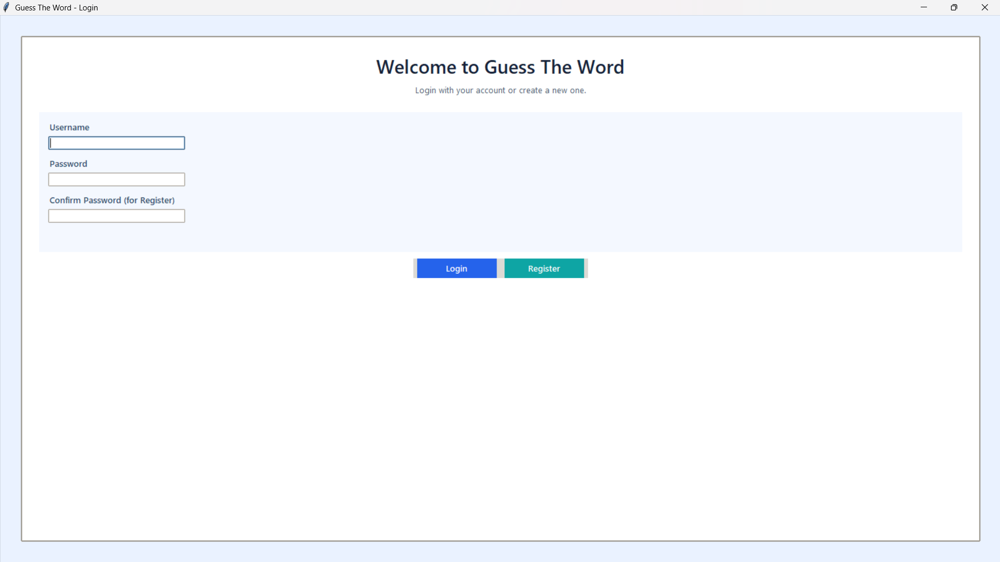
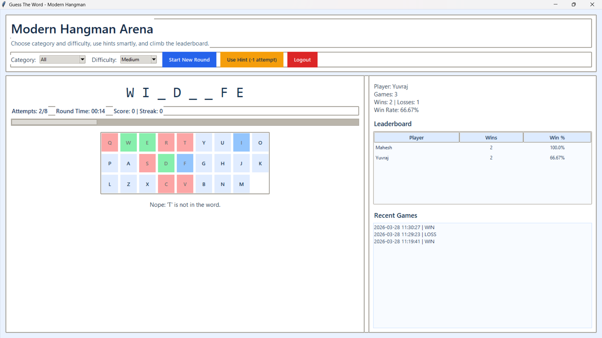

# Guess The Word Game

Modern Hangman game built with Python, Tkinter, and SQLite.

## New Upgrades

- Added secure authentication flow with Register and Login
- Enforced unique usernames (username cannot be reused)
- Added password-based login with hashed password storage
- Added logout flow to return to login screen without opening extra windows
- Redesigned UI with a larger default window and modern color theme
- Added difficulty levels: Easy, Medium, Hard
- Added word categories and smarter word selection
- Added hint system with attempt penalty
- Added live timer, score, and streak tracking
- Added leaderboard and recent games panel
- Auto-loads a new word after every win or loss

## Features

- Tkinter GUI-based interactive Hangman gameplay
- SQLite persistence for players and game history
- Win/loss tracking and win-rate calculation
- Real-time player stats panel
- Top-player leaderboard

## Tech Stack

- Python 3
- Tkinter
- SQLite3

## Project Structure

- Guess The Word Game.py: Main game with login, dashboard, and gameplay
- pythondatabase.db: Local SQLite database (ignored in git)
- .gitignore: Excludes local and generated files

## Run Locally

1. Clone repository

```bash
git clone https://github.com/yuvrajsodha0009/guess-the-word-game
```

2. Move into project folder

```bash
cd guess-the-word-game
```

3. Start the game

```bash
python "Guess The Word Game.py"
```

## Screenshots

Login Screen:



Game Dashboard:



